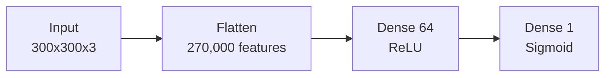
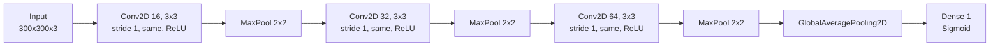

# neural-networks-convolutional-layers

## Problem description

This is an assignment for the TDSE neural networks course. The goal isn't to get the highest accuracy possible — it's to understand *why* convolutional layers work the way they do for image data, by building a non-convolutional baseline, designing a CNN from scratch and justifying every architectural choice, running a controlled experiment on one aspect of the convolutional layer, and interpreting the results in terms of inductive bias.

Full work (EDA, both models, the experiment, and the write-up) is in [`convolutional-layers.ipynb`](convolutional-layers.ipynb).

## Dataset description

[`horses_or_humans`](https://www.tensorflow.org/datasets/catalog/horses_or_humans) from TensorFlow Datasets — a binary image classification problem, horse vs. human, chosen because the classes are defined by shape and silhouette: local patterns that repeat across positions in the image, which is exactly what convolution is built to exploit.

- **Size:** 1,283 images total — 1,027 train / 256 test (80/20).
- **Classes:** roughly balanced. Train: 500 horses / 527 humans. Test: 128 / 128.
- **Images:** 300x300x3, RGB, `uint8` in `[0, 255]`.
- **Preprocessing:** normalized to `[0, 1]` (needed — raw `uint8` values produce large, unstable gradients). No resizing needed, every image is already a uniform 300x300x3.
- **Train/validation split:** the training set is further split 85/15 (~873 / ~154) to monitor overfitting without touching the test set. Done via TFDS slicing on the raw split, before any shuffling, so the boundary stays stable across epochs.

## Architecture

### Baseline (non-convolutional)

**17,280,129 parameters** — almost all of it (17,280,064) in the first Dense layer, because flattening treats every one of the 270,000 pixels as an independent input feature with its own weight.

### Convolutional architecture

**23,649 parameters** — about 730x fewer than the baseline. Design choices, briefly (full reasoning in the notebook, section 3):

- **3 conv layers:** horse-vs-human is a coarse shape/silhouette task, doesn't need many layers of hierarchical abstraction.
- **3x3 kernels:** smallest kernel with full 2D context; stacking three grows the receptive field like bigger kernels would, for far fewer parameters.
- **Stride 1, `'same'` padding:** convolutions extract features at full resolution, pooling handles all the downsampling.
- **ReLU** in every conv layer (cheap, avoids vanishing gradients), **sigmoid** on the output (binary classification).
- **MaxPooling** after each conv layer (keeps the strongest local activation, invariant to small shifts), and **GlobalAveragePooling2D** instead of Flatten before the output — deliberately, to avoid recreating the baseline's problem: flattening the final 37x37x64 feature map would need ~87,600 input features and blow the parameter count up again.

## Experimental results

### Baseline instability

The baseline was run three separate times (no fixed seed), and the outcome was different every time:

| Run | Final train acc | Final val acc | Notes |
|---|---|---|---|
| A | ~87% | 68.8% | Peaked at 92.9% (epoch 27), then collapsed by epoch 30 |
| B | 52.6% | 44.2% | Flat at chance level for all 30 epochs — never learned |
| C | 86.7% | 92.9% | Peaked at 95.5% (epoch 27), stayed high |

Same code, three different stories. Loss values were also consistently large (routinely in the tens, sometimes past 100) — far more than you'd expect from binary cross-entropy, and a sign optimization itself was struggling, not just slow. Both point back to the same cause: 17.28M parameters for ~873 images leaves the loss surface massively underdetermined.

### Convolutional model

The CNN above (kernel 3x3), trained for 9 epochs: final train accuracy 71.0% (loss 0.639), final val accuracy 68.2% (loss 0.641), best val accuracy 71.4% at epoch 8. Unlike the baseline, loss decreased smoothly and monotonically every epoch, staying inside a tight 0.58–0.70 band.

### Controlled experiment: kernel size (3x3 vs. 5x5)

Everything else fixed (depth, filter counts, stride, padding, activations, pooling, optimizer, data), 9 identical epochs each:

| | kernel 3x3 | kernel 5x5 |
|---|---|---|
| Parameters | 23,649 | 65,377 |
| Time / epoch | ~27.5s | ~51.4s |
| Final train acc / loss | 71.0% / 0.639 | 68.8% / 0.580 |
| Final val acc / loss | 68.2% / 0.641 | 64.3% / 0.616 |
| Best val acc | 71.4% (epoch 8) | 72.1% (epoch 8) |

5x5 starts learning 1-2 epochs earlier and has lower loss than 3x3 in *every single epoch*, train and validation both. Accuracy is messier — both peak at the same epoch within a point of each other, then both drop, and 3x3 happens to drop less, ending marginally ahead. With only 5 validation batches (~154 images), a handful of borderline predictions is enough to swing accuracy by several points, so the loss curve (consistently favoring 5x5) is the more trustworthy signal here. Trade-off: 5x5 costs 2.8x the parameters and ~1.9x the time per epoch for that head start.

## Interpretation

**Why did the CNN outperform (or not) the baseline?** Not on a raw final-accuracy comparison — the baseline's luckiest run beat both CNN variants. But that number isn't trustworthy: the same baseline code produced three qualitatively different outcomes across three runs. The CNN, in contrast, improved smoothly and predictably every single time, with loss confined to a narrow band regardless of run or kernel size. The real advantage is reliability, not a bigger number after a fixed training budget.

**What inductive bias does convolution introduce?** That a useful local pattern is worth detecting the same way regardless of where it appears — weight sharing — plus locality, the assumption that nearby pixels are more related than distant ones. Both are visible directly in the parameter counts: 448 weights for the first conv layer vs. 17.28 million for the baseline's first dense layer, covering the same input.

**Where would convolution not be appropriate?** Anywhere there's no meaningful, consistent spatial neighborhood for a kernel to slide across: tabular data (reordering columns doesn't change their meaning), graph-structured data (no fixed grid), problems where absolute position *is* the signal (a fixed-layout form), or data with long-range dependencies that don't decay with distance (which is part of why attention, not convolution, is the default for language).
